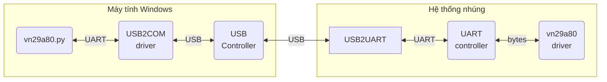

# Trình điều khiển thiết bị cho bộ đếm vn29a80

## 1. Biên dịch

### 1-1. Biên dịch cho host (native compile)

Giả định rằng:
- Bạn đang sử dụng máy tính của mình để phát triển device driver chạy trên các máy tính khác có cùng kiến trúc CPU.
- Bạn đã cài đặt linux-headers (`sudo apt install linux-headers-$(uname -r)` hoặc `sudo apt install linux-headers-generic`)

Bước 1: Thiết lập một số biến môi trường cần thiết:

```bash
# [Host PC (WSL2)]
export KERNEL_SRC=/lib/modules/$(uname -r)/build

# hoặc
export KERNEL_SRC=/lib/modules/5.15.0-153-generic/build
```

Bước 2: Đứng từ thư mục gốc hoặc thư mục `uart`, hãy gõ lệnh:

```bash
# [Host PC (WSL2)]
make
```

Kết quả ta thu được các driver module (*.ko) trong thư mục `uart`. Ta có thể dùng lệnh `modinfo` để kiểm tra thông tin của các module này.

### 1-2. Biên dịch cho target (cross compile)

Giả định rằng:

- Bạn đang sử dụng PC (ví dụ WSL2) để phát triển device driver chạy trên các hệ nhúng dùng chip kiến trúc ARM (ví dụ ZCU102).
- Bạn đã cài đặt SDK (từ Yocto build) tại thư mục `~/local` của WSL2.

Bước 1: Thiết lập một số biến môi trường cần thiết:

```bash
# [Host PC (WSL2)]
source ~/local/environment-setup-aarch64-xilinx-linux
export KERNEL_SRC=$OECORE_TARGET_SYSROOT/usr/src/kernel
```

Bước 2: Đứng từ thư mục gốc hoặc thư mục `uart`, hãy gõ lệnh:

```bash
# [Host PC (WSL2)]
make
```

Kết quả ta thu được các driver module (*.ko) trong thư mục `uart`. Ta có thể dùng lệnh `modinfo` để kiểm tra thông tin của các module này.

## 2. Cài đặt và tải nạp

### 2-1. Cài đặt tạm thời và tải nạp thủ công

Bước 1: Tải các driver module cần thiết xuống board.

```bash
# [Host PC (WSL2)]
cd uart/
scp *.ko zcu102:/tmp/
```

Bước 2: Tải nạp các driver module vào trong kernel space.

```bash
# [Target board (ZCU102)]
cd /tmp
insmod uartdev_core.ko
insmod counter_vn29a80.ko
```

Bạn có thể gặp lỗi sau:
```
insmod: ERROR: could not insert module uartdev_core.ko: Invalid module format
```

Lỗi này rất có thể do version magic của uartdev_core.ko không phù hợp với phiên bản Linux kernel đang chạy trên board. Ta có thể kiểm tra bằng cách xem kernel log (dùng lệnh `dmesg`). Nếu như đúng như vậy thì làm theo một trong 2 cách sau:
- Tìm kiếm và cài đặt lại SDK khác, phù hợp với phiên bản Linux kernel đang chạy trên board, sau đó biên dịch lại uartdev_core.ko.
- Sửa `UTS_RELEASE` trong tệp tin `$KERNEL_SRC/include/generated/utsrelease.h` thành phiên bản Linux kernel đang chạy trên board, sau đó biên dịch lại uartdev_core.ko. Tuy nhiên, cách này không được khuyến khích.

### 2-2. Cài đặt vĩnh viễn và tải nạp tự động

Bước 1: Tải các driver module cần thiết xuống board.

```bash
# [Host PC (WSL2)]
cd uart/
scp *.ko zcu102:/tmp
```

Bước 2: Cài đặt vào rootfs.

```bash
# [Target board (ZCU102)]
mount -o remount,rw /
mkdir -p /lib/modules/$(uname -r)/extra
cp /tmp/*.ko /lib/modules/$(uname -r)/extra
depmod
```

Sau bước này:
- các tệp tin `modules.alias` và `modules.dep` (cùng với các tệp tin nhị phân tương ứng) sẽ được cập nhật.
- bạn có thể dùng lệnh `modprobe counter_vn29a80` để tải nạp `counter_vn29a80.ko` cùng với `uartdev_core.ko` mà không cần phải nhập 2 lệnh `insmod`.
- mỗi khi khởi động máy tính, nếu kernel tìm thấy một node trong device tree tương thích với trình điều khiển này, cả `counter_vn29a80.ko` và `uartdev_core.ko` sẽ được tải nạp vào hệ thống.

## 3. Kiểm thử

### 3-1. Kiểm thử tích hợp (IT test)

Mình đã thực hiện IT test trên ZCU102 Evaluation Kit. Việc đánh giá trên các target board khác như Raspberry Pi hay BeagleBoard cũng tương tự.

Sơ đồ kiểm thử như sau:



Bước 0: Cập nhật device tree (chỉ cần làm 1 lần)

Trên board ZCU102, device tree được đặt trong `/boot/devicetree.img`.

Hãy sao chép nó lên PC và tách lấy device tree.

```bash
# [Host PC (WSL2)]

## cài đặt extract-dtb
pip install extract-dtb

## tách lấy phần device tree
extract-dtb devicetree.img -o dt/
cd dt/
dtc -I dtb -O dts -o my_devicetree.dts 01_dtbdump_xlnx,zynqmp-zcu102-rev1.0.dtb
```

Sau đó, thêm đoạn mã sau vào trong node `serial@ff010000` (chính là console thứ 2 của ZCU102):
```
    counter1 {
        compatible = "hcm,vn29a80";
        status = "okay";
        baudrate = <0x9600>;
        parity = "even";
    };
```

Tiếp theo, biên dịch device tree source thành device tree blob:
```bash
# [Host PC (WSL2)]
dtc -I dts -O dtb -o my_devicetree.dtb my_devicetree.dts
```

Cuối cùng, hãy tạo ra tệp tin devicetree.img và cập nhật trên board.
```bash
# [Host PC (WSL2)]
cat 00_kernel my_devicetree.dtb > my_devicetree.img
scp my_devicetree.img zcu102:/boot/devicetree.img

# [Target board]
reboot
```

Bước 1: Tải các driver module cần thiết xuống board.

```bash
# [Host PC (WSL2)]
cd uart/
scp *.ko zcu102:/tmp/
```

Bước 2: Tải chương trình kiểm thử xuống board.

```bash
# [Host PC (WSL2)]
cd test/ && make && scp build/bin/test_counter_vn29a80 zcu102:/tmp
```
Bước 3: Chạy chương trình mô phỏng bộ đếm vn29a80
```bash
# [Host PC (Windows)]
# Giả sử Interface 1 là COM6 (sử dụng Device Manager để kiểm tra)
python vn29a80.py COM6 dump
```

Bước 3: Chạy chương trình kiểm thử trên board.

```bash
# [Target board (ZCU102)]
/tmp/test_counter_vn29a80
```

## 4. Giao tiếp với trình điều khiển

### 4-1. Giao tiếp thông qua device file

Dưới đây là hướng dẫn viết một ứng dụng trên user space để giao tiếp với vn29a80 driver thông qua device file `/dev/counter1`.

```cpp
// Tham chiếu header file.
#include "counter_vn29a80.h"

// Mở character device file /dev/counterX (`counterX` là tên của node tương ứng với thiết bị trong device tree)
int fd = open("/dev/counter1", O_RDWR);
if (fd >= 0) {
    // OK
} else {
    // NG
}

// để thiết lập giá trị 0x0a1b2c3d cho bộ đếm
struct vn29a80_cmd cmd;
cmd.id = CMD_ID_SET_COUNTER;
cmd.param_cnt = 0x0a1b2c3d;
if (0 == write(fd, &cmd, sizeof(cmd))) {
    // OK
} else {
    // NG
}

// để đọc giá trị hiện tại của bộ đếm
struct vn29a80_data data;
if (0 == read(fd, &data, sizeof(data))) {
    // OK
} else {
    // NG
}

// Để lấy thời hạn gửi
uint32_t send_timeout_ms = 0;
if (0 == ioctl(fd, DEV_GET_SEND_TIMEOUT, &send_timeout_ms)) {
    // OK
} else {
    // NG
}

// Để thay đổi thời hạn nhận thành to 5000ms
if(0 == ioctl(fd, DEV_SET_RECV_TIMEOUT, 5000)) {
    // OK
} else {
    // NG
}

// Để đóng device file
close(fd);
```

### 4-2. Giao tiếp thông qua sysfs files

Dưới đây là hướng dẫn sử dụng các lệnh trên user space để giao tiếp với vn29a80 driver thông qua sysfs files trong thư mục `/sys/class/uartdev/counter1/`.

```bash
# để thiết lập giá trị 0x0a1b2c3d cho bộ đếm
echo "\$REQ:02:0A1B2C3D:@" > /sys/class/uartdev/counter1/req_raw

# để xem bản tin yêu cầu vừa gửi cho bộ đếm
cat /sys/class/uartdev/counter1/req_raw

# để xem bản tin phản hồi vừa nhận từ bộ đếm
cat /sys/class/uartdev/counter1/res_raw

# để xem dữ liệu mới nhất nhận từ bộ đếm
cat /sys/class/uartdev/counter1/data

# để xem thời hạn gửi (ms) và thời hạn nhận (ms)
cat /sys/class/uartdev/counter1/timeout

# để thay đổi thời hạn gửi thành 1000(ms) và thời hạn nhận 2000(ms)
echo 1000:2000 > /sys/class/uartdev/counter1/timeout
```