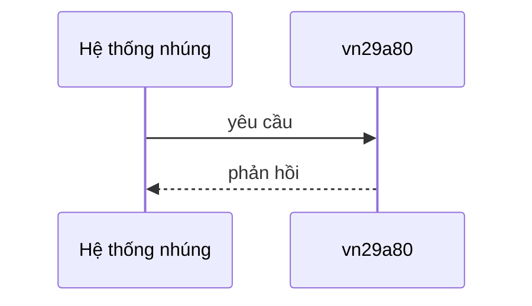
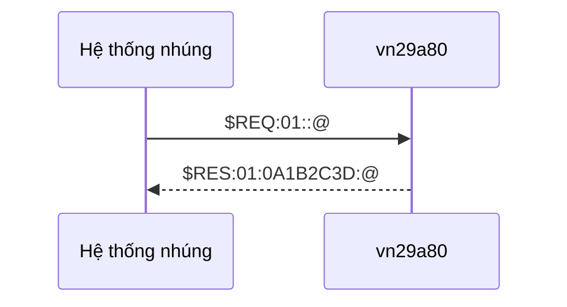
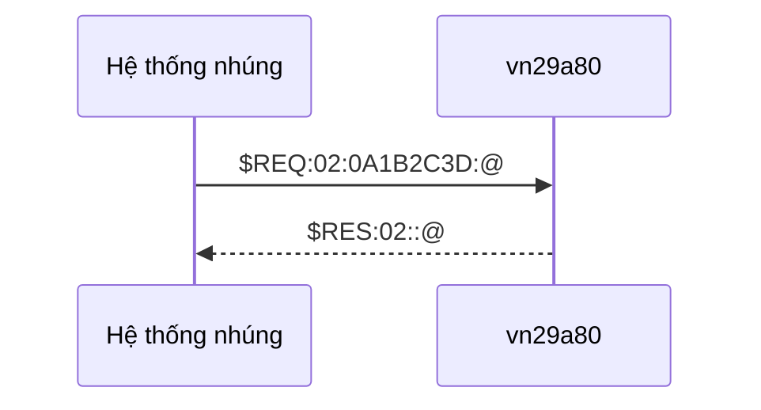

# Tài liệu đặc tả bộ đếm vn29a80

## Các phiên bản

| Phiên bản | Ngày chỉnh sửa | Người chỉnh sửa | Nội dung chỉnh sửa |
| --------- | -------------- | --------------- | ------------------ |
| 0.1       | 27/08/2025     | Nguyễn Tiến Đạt | Tạo mới            |

## Giới thiệu

Tài liệu này dùng để mô tả giao diện điều khiển của một thiết bị giả tưởng có tên vn29a80.

Thiết bị này là một bộ đếm vòng (circular counter) 32 bits. Khi khởi động, bộ đếm bắt đầu từ 0. Khi tăng lên đến 4294967295, bộ đếm sẽ bắt đầu lại từ 0.

## Giao diện phần cứng

Hệ thống nhúng có thể giao tiếp với vn29a80 thông qua kết nối UART.

Kết nối UART có các thông số kỹ thuật sau:

| Thông số  | Giá trị |
| --------- | ------- |
| baud rate | 38400   |
| parity    | chẵn    |
| stop bits | 1 bit   |
| data bits | 8 bits  |

## Giao diện phần mềm.

### Mô hình giao tiếp

- Mô hình giao tiếp: master - slave.
  - Hệ thống nhúng đóng vai trò master, vn29a80 đóng vai trò slave.
  - Hệ thống nhúng gửi yêu cầu, sau đó vn29a80 sẽ gửi phản hồi.
  - vn29a80 chỉ gửi phản hồi sau khi nhận được yêu cầu từ hệ thống nhúng.
  - vn29a80 sẽ gửi phản hồi trong vòng 50ms kể từ khi nhận được yêu cầu.

### Cấu trúc bản tin

Các bản tin yêu cầu từ hệ thống nhúng hoặc các bản tin phản hồi từ vn29a80 gồm các thành phần sau:

| Thành phần | Kích thước (bytes) | Giá trị                                                                                        | Mô tả                    |
| ---------- | ------------------ | ---------------------------------------------------------------------------------------------- | ------------------------ |
| Đầu đề     | 4                  | "\$REQ" nếu là bản tin yêu cầu hoặc "$RES" nếu là bản tin phản hồi                          | Mở đầu bản tin           |
| Định danh  | 2                  | mỗi byte có giá trị từ '0' đến 'F' (tức là nằm trong khoảng [0x30..0x39] hoặc [0x41..0x46]) | Mã yêu cầu hoặc phản hồi |
| Tham số    | n (>= 0)           | mỗi byte có giá trị từ '0' đến 'F' (tức là nằm trong khoảng [0x30..0x39] hoặc [0x41..0x46]) | Tham số bổ trợ           |
| Kết thúc   | 1                  | '@'                                                                                            | Kết thúc bản tin         |

Chú ý:
- Các thành phần trên được ngăn cách với nhau bởi ký tự ':'.
- Nếu có từ 2 tham số trở lên, dấu ',' được dùng để ngăn cách các tham số với nhau.

### Mô tả các yêu cầu và phản hồi.

#### Lệnh lấy giá trị hiện tại của bộ đếm.

- Bản tin yêu cầu:

| Thành phần | Kích thước (bytes) | Giá trị | Mô tả            |
| ---------- | ------------------ | ------- | ---------------- |
| Đầu đề     | 4                  | "$REQ"  | Mở đầu bản tin   |
| Định danh  | 2                  | "01"    | Mã yêu cầu       |
| Tham số    | 0                  |         | Không có         |
| Kết thúc   | 1                  | '@'     | Kết thúc bản tin |

- Bản tin phản hồi:

| Thành phần | Kích thước (bytes) | Giá trị                                                                                        | Mô tả                       |
| ---------- | ------------------ | ---------------------------------------------------------------------------------------------- | --------------------------- |
| Đầu đề     | 4                  | "$RES"                                                                                         | Mở đầu bản tin              |
| Định danh  | 2                  | "01"                                                                                           | Mã phản hồi                 |
| Tham số    | 8                  | mỗi byte có giá trị từ '0' đến 'F' (tức là nằm trong khoảng [0x30..0x39] hoặc [0x41..0x46]) | Giá trị hiện tại của bộ đếm |
| Kết thúc   | 1                  | '@'                                                                                            | Kết thúc bản tin            |

- Ví dụ:

#### Lệnh thiết lập giá trị mới cho bộ đếm.

- Bản tin yêu cầu:

| Thành phần | Kích thước (bytes) | Giá trị                                                                                        | Mô tả                  |
| ---------- | ------------------ | ---------------------------------------------------------------------------------------------- | ---------------------- |
| Đầu đề     | 4                  | "$REQ"                                                                                         | Mở đầu bản tin         |
| Định danh  | 2                  | "02"                                                                                           | Mã yêu cầu             |
| Tham số    | 8                  | mỗi byte có giá trị từ '0' đến 'F' (tức là nằm trong khoảng [0x30..0x39] hoặc [0x41..0x46]) | Giá trị mới của bộ đếm |
| Kết thúc   | 1                  | '@'                                                                                            | Kết thúc bản tin       |

- Bản tin phản hồi:

| Thành phần | Kích thước (bytes) | Giá trị | Mô tả            |
| ---------- | ------------------ | ------- | ---------------- |
| Đầu đề     | 4                  | "$RES"  | Mở đầu bản tin   |
| Định danh  | 2                  | "02"    | Mã phản hồi      |
| Tham số    | 0                  |         | Không có         |
| Kết thúc   | 1                  | '@'     | Kết thúc bản tin |

- Ví dụ:

