# Tài liệu thiết kế trình điều khiển cho thiết bị vn29a80

## Các phiên bản

| Phiên bản | Ngày chỉnh sửa | Người chỉnh sửa | Nội dung chỉnh sửa |
| --------- | -------------- | --------------- | ------------------ |
| 0.1       | 28/08/2025     | Nguyễn Tiến Đạt | Tạo mới            |

## Giới thiệu

Đây là tài liệu thiết kế trình điều khiển thiết bị [vn29a80](https://github.com/vietnam-engineer/linux_driver/blob/main/uart/doc/vn29a80_ICD.md), một bộ đếm 32 bits giả tưởng.

Tài liệu thiết kế này sẽ:
- xác định các yêu cầu mà trình điều khiển vn29a80 cần phải đáp ứng.
- mô tả cấu trúc và hoạt động của trình điều khiển vn29a80.

Với việc áp dụng triết lý hướng đối tượng, mình hy vọng sẽ gợi mở một hướng tiếp cận khác trong việc phát triển Linux device driver. Mình xin gửi tặng tài liệu này tới toàn thể kỹ sư lập trình nhúng trên mọi miền Tổ quốc.

## Xác định yêu cầu

### Các yêu cầu chức năng

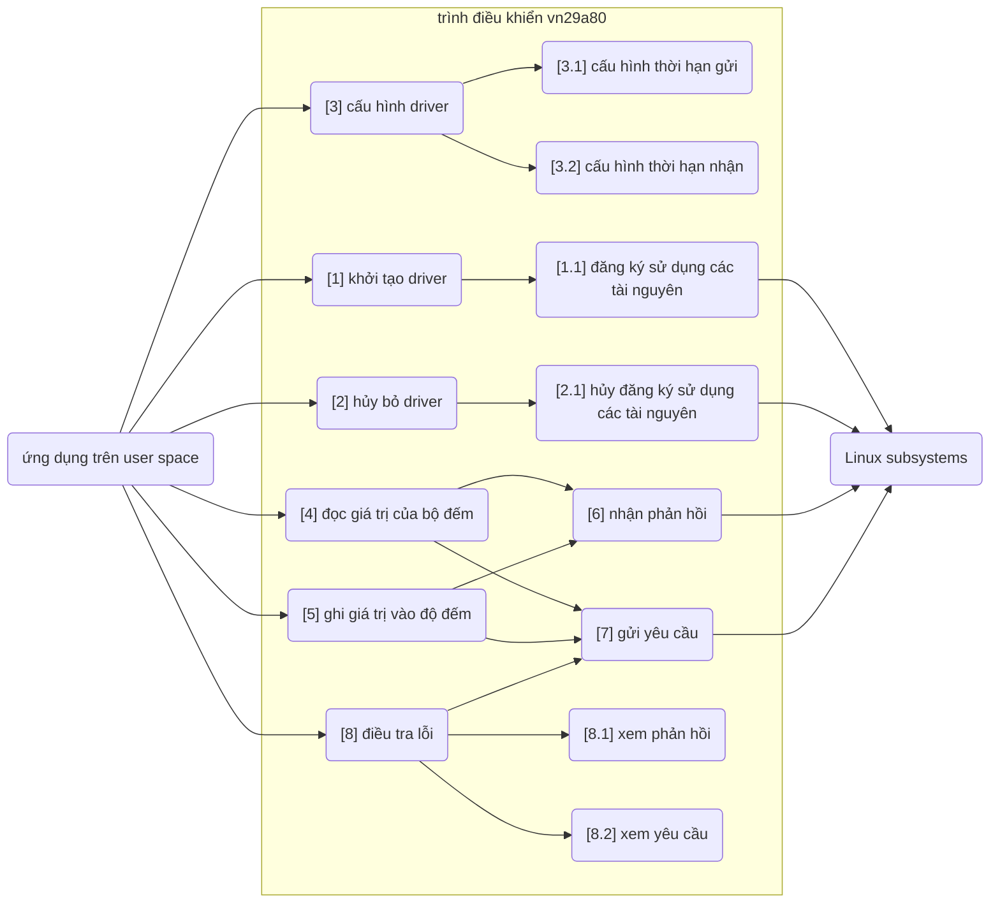

### Các yêu cầu phi chức năng

- Người dùng có thể tải nạp hoặc gỡ bỏ trình điều khiển khi cần.
- Người dùng có thể cấu hình hệ thống để trình điều khiển được tự động tải nạp khi khởi động hệ thống.
- Trong trường hợp hệ thống kết nối với nhiều thiết bị vn29a80, hệ thống có khả năng nhân bản trình điều khiển, mỗi bản sao điều khiển một thiết bị.
- Trình điều khiển có thể hoạt động trong các hệ thống có Linux kernel phiên bản 5.x trở lên.

## Tổng quan hệ thống

Từ các yêu cầu kể trên, trình điều khiển vn29a80, hay còn gọi là vn29a80 driver, sẽ được chia làm gồm 4 khối chức năng chính:
- `uif` (user-space interface): chịu trách nhiệm tiếp nhận lệnh và trả về dữ liệu cho các ứng dụng trên user-space
- `uart`: chịu trách nhiệm gửi yêu cầu tới và nhận phản hồi từ vn29a80.
- `req`: chịu trách nhiệm chuyển đổi các lệnh của user-space thành các yêu cầu phù hợp với vn29a80.
- `res`: chịu trách nhiệm chuyển các phản hồi của vn29a80 thành các dữ liệu cho user-space.

Dưới đây là bức tranh toàn cảnh mô tả vn29a80 driver và vị trí của nó trong hệ thống.

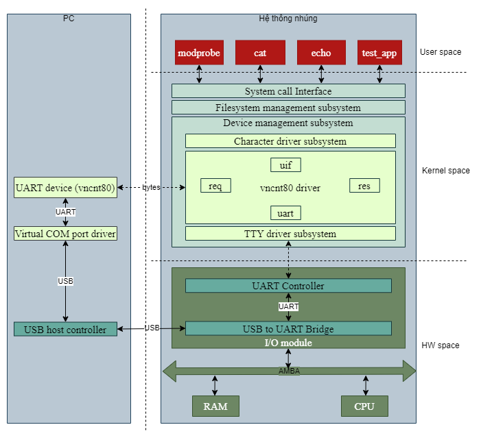

## Xây dựng giao diện

### Giao diện của uif

| giao diện  | đối tượng phục vụ          | dịch vụ cung cấp                                           | Usecase liên quan |
| ---------- | -------------------------- | ---------------------------------------------------------- | ----------------- |
| setup      | vn29a80 driver             | khởi tạo đối tượng uif                                     | 1                 |
| cleanup    | vn29a80 driver             | hủy bỏ đối tượng uif                                       | 2                 |
| register   | vn29a80 driver             | đăng ký thành lập các device file và sysfs files           | 1.1               |
| unregister | vn29a80 driver             | đăng ký giải thể các devie file và sysfs files             | 2.1               |
| read       | Character driver subsystem | xử lý khi ứng dụng đọc từ device file                      | 4                 |
| write      | Character driver subsystem | xử lý khi ứng dụng viết vào device file                    | 5                 |
| ioctl      | Character driver subsystem | xử lý khi ứng dụng cấu hình thiết bị hoặc trình điều khiển | 3                 |
| res_show   | sysfs                      | xử lý khi ứng dụng xem phản hồi vừa nhận từ thiết bị       | 8.1               |
| req_show   | sysfs                      | xử lý khi ứng dụng xem yêu cầu vừa gửi tới thiết bị        | 8.2               |

### Giao diện của uart

| giao diện        | đối tượng phục vụ | dịch vụ cung cấp                 | Usecase liên quan |
| ---------------- | ----------------- | -------------------------------- | ----------------- |
| setup            | vn29a80 driver    | khởi tạo đối tượng uart          | 1                 |
| cleanup          | vn29a80 driver    | hủy bỏ đối tượng uart            | 2                 |
| register         | vn29a80 driver    | đăng ký sử dụng uart port        | 1.1               |
| unregister       | vn29a80 driver    | đăng ký ngừng sử dụng uart port  | 2.1               |
| send_req         | uif               | gửi yêu cầu tới thiết bị         | 7                 |
| set_send_timeout | uif               | truy nhập thời hạn gửi yêu cầu   | 3.1               |
| get_send_timeout | uif               | truy xuất thời hạn gửi yêu cầu   | 3.1               |
| set_recv_timeout | uif               | truy nhập thời hạn nhận phản hồi | 3.2               |
| get_recv_timeout | uif               | truy xuất thời hạn nhận phản hồi | 3.2               |

### Giao diện của req

| giao diện | đối tượng phục vụ | dịch vụ cung cấp       | Usecase liên quan |
| --------- | ----------------- | ---------------------- | ----------------- |
| setup     | vn29a80 driver    | khởi tạo đối tượng req | 1                 |
| cleanup   | vn29a80 driver    | hủy bỏ đối tượng req   | 2                 |
| create    | uif               | tạo ra bản tin yêu cầu | 1.1               |
| get       | uif               | lấy bản tin yêu cầu    | 2.1               |

### Giao diện của res

| giao diện       | đối tượng phục vụ | dịch vụ cung cấp           | Usecase liên quan |
| --------------- | ----------------- | -------------------------- | ----------------- |
| setup           | vn29a80 driver    | khởi tạo đối tượng res     | 1                 |
| cleanup         | vn29a80 driver    | hủy bỏ đối tượng res       | 2                 |
| set_raw         | uif               | lưu bản tin phản hồi       | 6                 |
| get_raw         | uif               | lấy bản tin phản hồi       | 8.1               |
| clear_raw       | uif               | xóa bản tin phản hồi       | 4                 |
| parse_raw       | uart              | phân tích bản tin phản hồi | 6                 |
| get_parsed_data | uif               | lấy thông tin đã phân tích | 4                 |

## Xây dựng cấu trúc

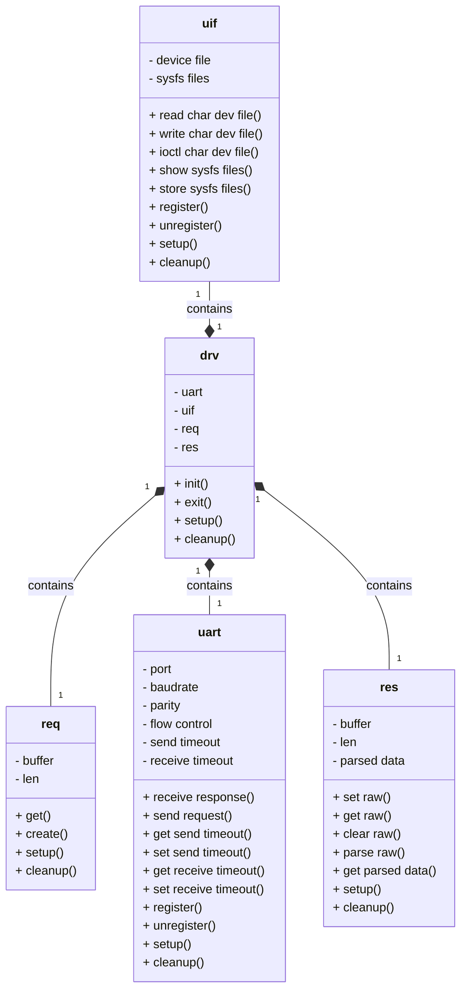

Trong tương lai, thiết bị vn29a80 có thể bị thay thể bởi một thiết bị khác hiện đại hơn, rẻ hơn. Mặc dù sẽ có một vài sự khác biệt nhất định, nhưng vẫn sẽ có những điểm chung. Để tiết kiệm công sức và chi phí phát triển device driver, ta hãy áp dụng tính kế thừa trong triết lý thiết kế hướng đối tượng.

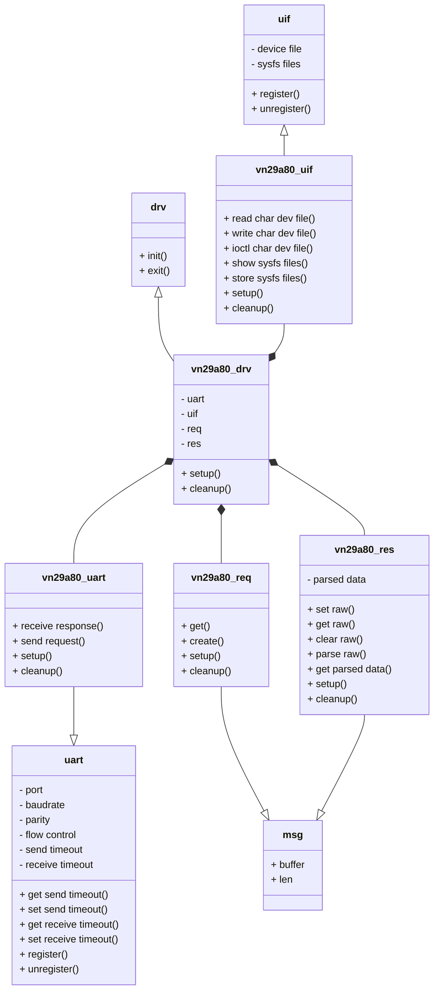

Từ đây, các lớp cha sẽ được nhóm vào một kernel module có tên là `uartdev_core`, còn các lớp con sẽ được nhóm vào một kernel module có tên là `counter_vn29a80`.

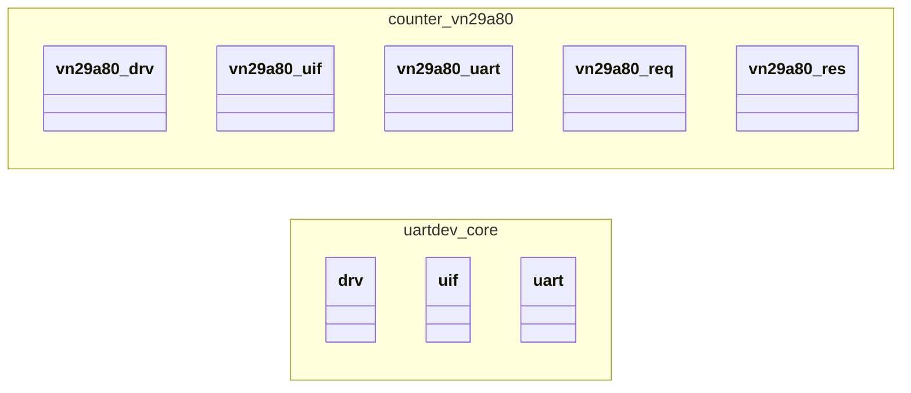

## Định nghĩa hành vi

### Quá trình khởi tạo driver

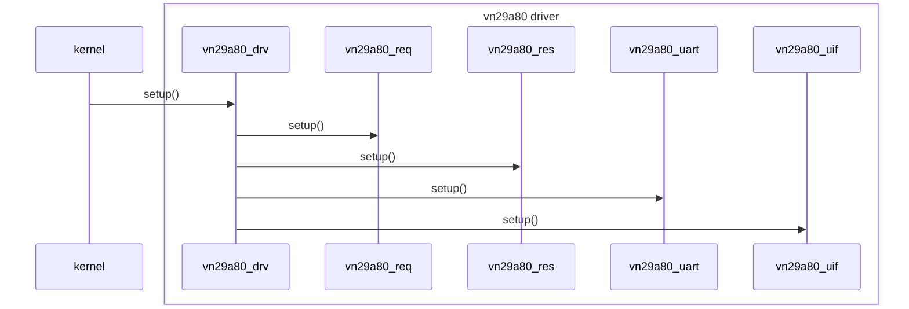

### Quá trình ghi giá trị vào bộ đếm

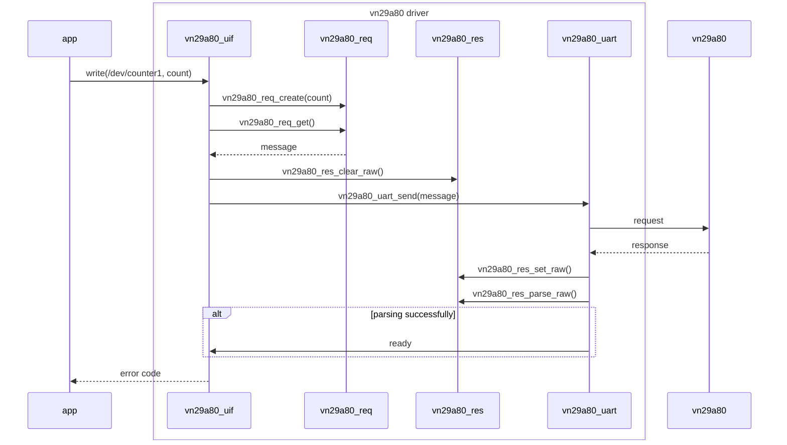

### Quá trình đọc dữ liệu của bộ đếm

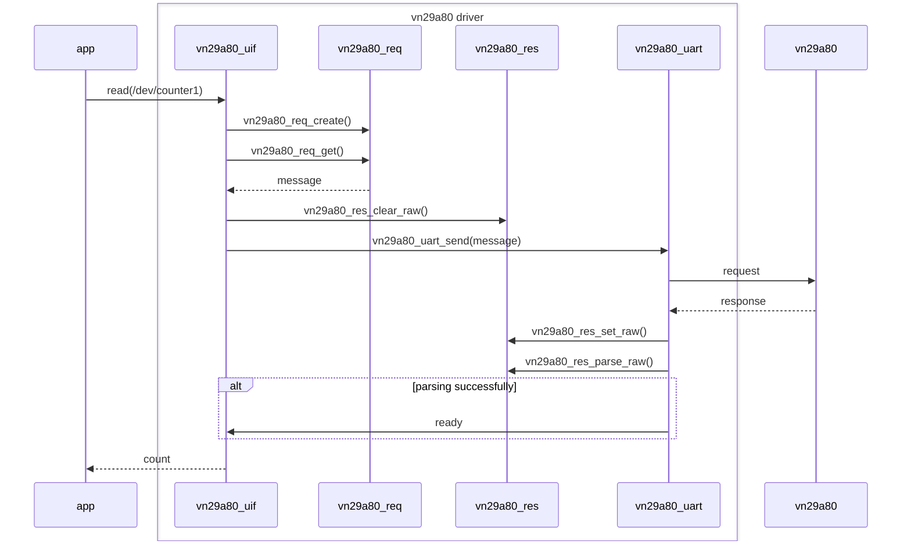

### Quá trình cấu hình driver

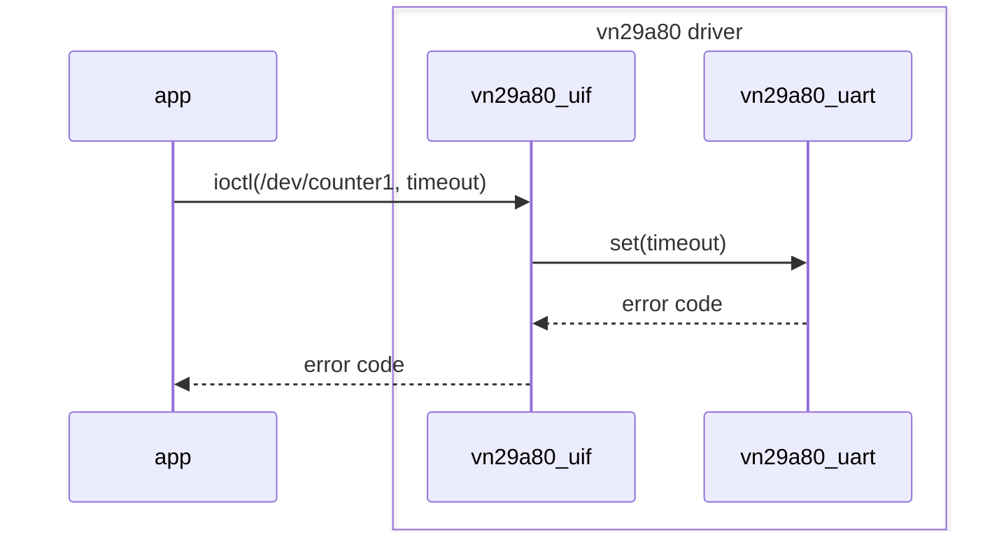

### Quá trình điều tra lỗi

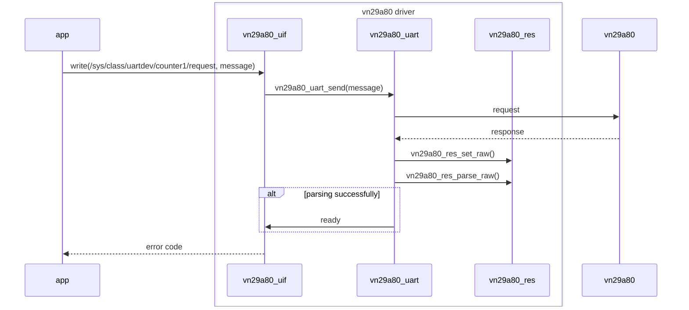

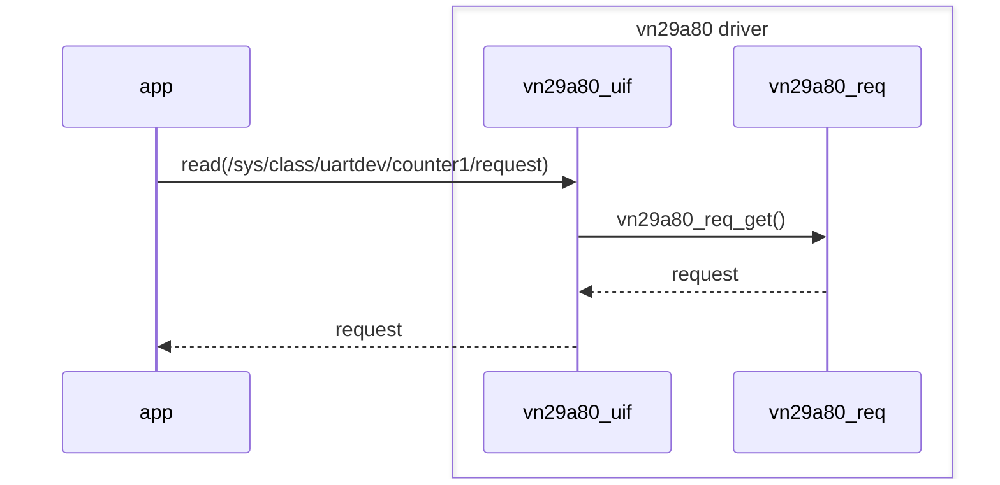

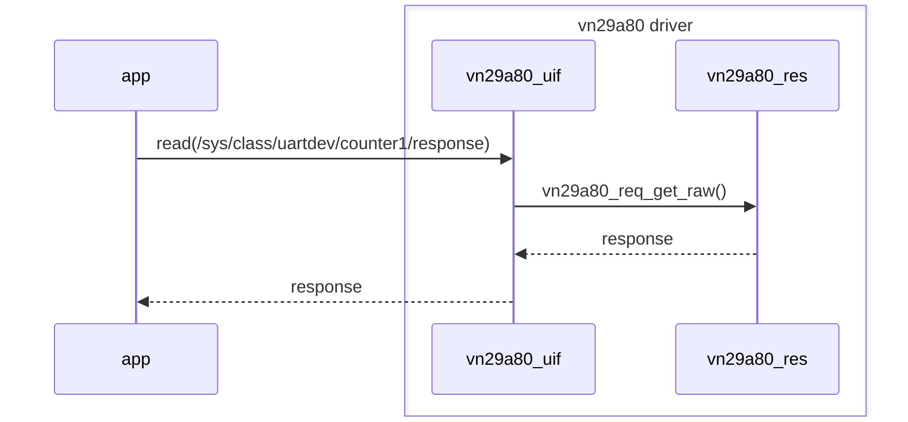
